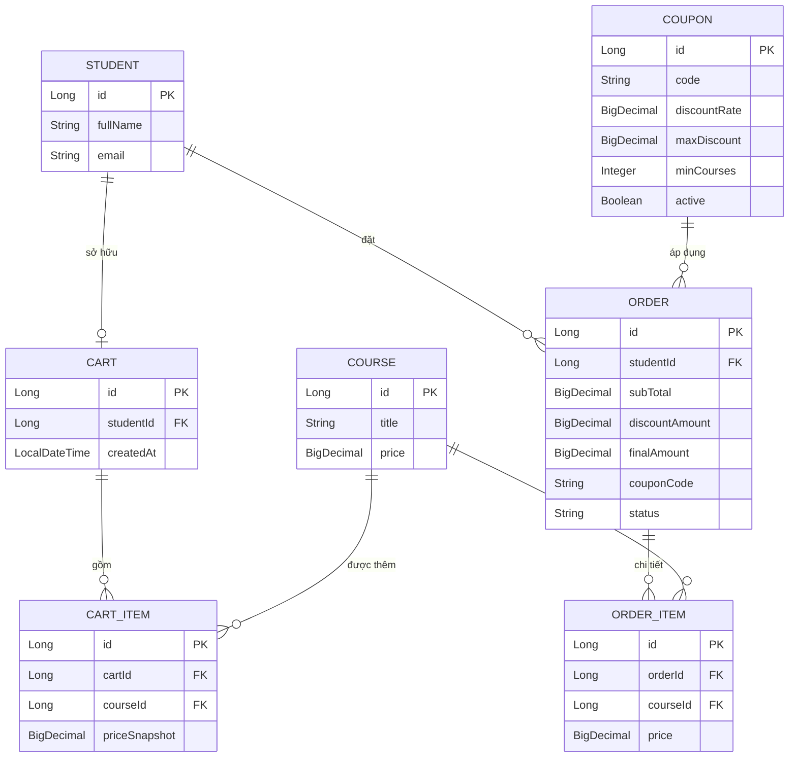

# TÀI LIỆU ĐẶC TẢ HỆ THỐNG (SRS) — ĐỀ 003

## Hệ thống E-learning — Nghiệp vụ Giỏ hàng & Mã giảm giá

**Sinh viên:** Nguyễn Thế Kiên
**Mã SV:** PTIT232
**Dự án:** Zip_De003 — Spring Boot 3.x + Gradle + Java 17
**Package:** `com.elearning`

---

# PHẦN 1: GIỚI THIỆU

## 1.1 Mục đích

Tài liệu này phân tích và đặc tả cấu trúc dữ liệu cho phân hệ **Giỏ hàng (Cart)** và **Mã giảm giá (Coupon)** bổ sung vào base code E-learning. Mục tiêu là mô phỏng luồng: học viên chọn khóa học → thêm vào giỏ → áp mã giảm giá → thanh toán → lưu trữ đơn hàng.

## 1.2 Phạm vi

- **Giỏ hàng:** thêm/xóa khóa học, tính tổng tiền tạm tính.
- **Mã giảm giá:** áp dụng theo quy tắc nghiệp vụ nâng cao (giảm 20%, chặn trần 500.000đ, tối thiểu 2 khóa học).
- **Đơn hàng & Lưu trữ:** ghi nhận đơn hàng đã thanh toán, lưu lịch sử ghi danh.

## 1.3 Thuật ngữ

| Thuật ngữ | Định nghĩa |
| --- | --- |
| **Cart** | Giỏ hàng tạm của học viên (chưa thanh toán) |
| **Coupon** | Mã giảm giá kèm điều kiện áp dụng |
| **Order** | Đơn hàng đã thanh toán, lưu trữ lâu dài |
| **subTotal** | Tổng tiền các khóa học trước khi giảm |
| **priceSnapshot** | Giá khóa học chốt tại thời điểm giao dịch |

---

# PHẦN 2: PHÂN TÍCH ENTITY

## 2.1 Entity hiện có (base code)

| Entity | Vai trò |
| --- | --- |
| **Student** | Học viên, sở hữu giỏ hàng và đơn hàng |
| **Course** | Khóa học có giá bán, được thêm vào giỏ |

## 2.2 Entity cần thêm

| Entity | Vai trò | Mô phỏng |
| --- | --- | --- |
| **Cart** | Giỏ hàng của học viên | Giỏ hàng |
| **CartItem** | Từng khóa học trong giỏ | Giỏ hàng |
| **Coupon** | Mã giảm giá & điều kiện | Mã giảm giá |
| **Order** | Đơn hàng sau thanh toán | Lưu trữ thông tin |
| **OrderItem** | Chi tiết khóa học trong đơn | Lưu trữ thông tin |

---

# PHẦN 3: THIẾT KẾ CẤU TRÚC DỮ LIỆU

## 3.1 Cart (Giỏ hàng)

| Trường | Kiểu | Ràng buộc | Mô tả |
| --- | --- | --- | --- |
| `id` | Long | PK, auto | Khóa chính |
| `studentId` | Long | FK → Student | Chủ giỏ hàng |
| `createdAt` | LocalDateTime | not null | Thời điểm tạo |
| `items` | List\<CartItem\> | 1..n | Danh sách khóa học trong giỏ |

## 3.2 CartItem (Chi tiết giỏ hàng)

| Trường | Kiểu | Ràng buộc | Mô tả |
| --- | --- | --- | --- |
| `id` | Long | PK, auto | Khóa chính |
| `cartId` | Long | FK → Cart | Thuộc giỏ hàng nào |
| `courseId` | Long | FK → Course | Khóa học được thêm |
| `priceSnapshot` | BigDecimal | not null | Giá khóa tại thời điểm thêm vào giỏ |

> Ràng buộc `unique(cartId, courseId)` — không thêm trùng khóa học vào giỏ.

## 3.3 Coupon (Mã giảm giá)

| Trường | Kiểu | Ràng buộc | Mô tả |
| --- | --- | --- | --- |
| `id` | Long | PK, auto | Khóa chính |
| `code` | String | unique, not null | Mã nhập vào (VD: `ELEARN20`) |
| `discountRate` | BigDecimal | 0..1 | Tỷ lệ giảm (0.20 = 20%) |
| `maxDiscount` | BigDecimal | not null | Mức chặn trần (500000) |
| `minCourses` | Integer | ≥ 1 | Số khóa học tối thiểu (2) |
| `active` | Boolean | not null | Mã còn hiệu lực hay không |

## 3.4 Order (Đơn hàng — Lưu trữ thông tin)

| Trường | Kiểu | Ràng buộc | Mô tả |
| --- | --- | --- | --- |
| `id` | Long | PK, auto | Khóa chính |
| `studentId` | Long | FK → Student | Người mua |
| `subTotal` | BigDecimal | not null | Tổng tiền trước giảm |
| `discountAmount` | BigDecimal | not null | Số tiền được giảm thực tế |
| `finalAmount` | BigDecimal | not null | Số tiền phải trả |
| `couponCode` | String | nullable | Mã đã áp (nếu có) |
| `status` | String | not null | PENDING / PAID / CANCELLED |
| `createdAt` | LocalDateTime | not null | Thời điểm tạo đơn |
| `items` | List\<OrderItem\> | 1..n | Chi tiết khóa học đã mua |

## 3.5 OrderItem (Chi tiết đơn hàng)

| Trường | Kiểu | Ràng buộc | Mô tả |
| --- | --- | --- | --- |
| `id` | Long | PK, auto | Khóa chính |
| `orderId` | Long | FK → Order | Thuộc đơn hàng nào |
| `courseId` | Long | FK → Course | Khóa học đã mua |
| `price` | BigDecimal | not null | Giá tại thời điểm mua |

---

# PHẦN 4: ĐIỀU KIỆN NGHIỆP VỤ (TỰ QUYẾT ĐỊNH)

| Điều kiện | Giá trị |
| --- | --- |
| Tỷ lệ giảm | **20%** tổng đơn hàng |
| Mức chặn trần | Tối đa **500.000đ** |
| Số khóa học tối thiểu | **≥ 2 khóa học** |
| Vi phạm | Ném `CouponNotApplicableException` (HTTP 400) |
| Làm tròn | `RoundingMode.HALF_UP`, scale 0 |

## Công thức

```
subTotal       = Σ (giá các khóa học trong giỏ)
rawDiscount    = subTotal × 0.20   (làm tròn HALF_UP)
discountAmount = min(rawDiscount, 500000)
finalAmount    = subTotal − discountAmount
```

## Ví dụ minh họa

| Số khóa | subTotal | rawDiscount (20%) | discountAmount | finalAmount |
| --- | --- | --- | --- | --- |
| 1 khóa | 800.000đ | — | **Báo lỗi** (< 2 khóa) | — |
| 2 khóa | 1.500.000đ | 300.000đ | 300.000đ | 1.200.000đ |
| 3 khóa | 3.700.000đ | 740.000đ | **500.000đ** (chặn trần) | 3.200.000đ |

---

# PHẦN 5: LUỒNG NGHIỆP VỤ

1. Học viên chọn khóa học → thêm vào **Cart** (tạo **CartItem**, chốt `priceSnapshot`).
2. Học viên nhập mã → hệ thống tra **Coupon** theo `code` (active).
3. Kiểm tra `courseCount ≥ minCourses`:
   - Không đủ → ném `CouponNotApplicableException`.
   - Đủ → `discountAmount = min(subTotal × rate, maxDiscount)`.
4. Thanh toán thành công → tạo **Order** + **OrderItem** (status = PAID), xóa giỏ.
5. Đơn hàng lưu trữ, học viên xem lại trong lịch sử.

---

# PHẦN 6: ERD DIAGRAM (Mermaid)



> **Lưu ý:** Sơ đồ ERD render từ mã Mermaid trên được lưu tại `docs/erd_diagram.png`.

---

# PHẦN 7: RÀNG BUỘC KỸ THUẬT

- Dùng `BigDecimal` cho mọi trường tiền tệ — tránh sai số làm tròn của `double`.
- `CartItem.priceSnapshot` và `OrderItem.price` chốt giá tại thời điểm giao dịch.
- Logic tính mã giảm giá tách riêng trong `CouponService` (tuân thủ SRP).
- Lỗi nghiệp vụ xử lý tập trung qua `@RestControllerAdvice`.
